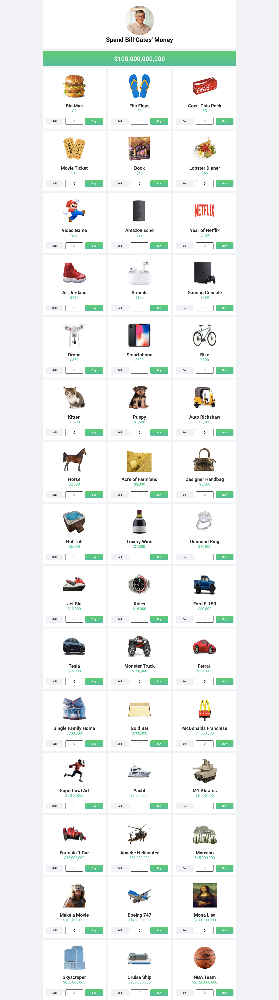

# 💸 Spend Bill Gates' Money - React Uygulaması

Bu proje, Bill Gates'in servetini harcamanıza olanak tanıyan eğlenceli ve interaktif bir alışveriş simülasyonudur. React ile geliştirilmiş bu uygulamada kullanıcılar, belirlenen ürünleri satın alarak bakiyelerini yönetirler.

## ⚙️ Kullanılan Teknolojiler

- React + Vite
- JavaScript
- CSS 

## 🎯 Özellikler

-  Başlangıç bakiyesi: $100,000,000,000
-  Ürün satın alma ve satma özelliği
-  Gerçek zamanlı bakiye takibi
-  Otomatik makbuz (receipt) oluşturma
-  Maksimum alım sınırı hesaplama
-  Bazı ürünlerde özel limit:  
   ├ ID 42: Maksimum 1 adet  
   └ ID 45: Maksimum 30 adet
-  Responsive tasarım

## 📁 Dosya Yapısı
```plaintext
 bill-gates/
├── Components/
│   ├── BalanceBar.jsx        
│   ├── ProductCard.jsx       
│   └── Receipt.jsx       
├── data      
│   └── products.js
├── utils      
│   └── formatPrice.js
├── App.css
├── App.jsx
├── index.css
└── main.jsz
```

## ⚙️ Kullanım Talimatları

1. Projeyi indirin veya klonlayın:

```
git clone https://github.com/devburcu/spend-bill-gates-money.git
```

2. cd spend-bill-gates-money

3. npm i

4. npm run dev


## 💻 Masaüstü Görünümü

